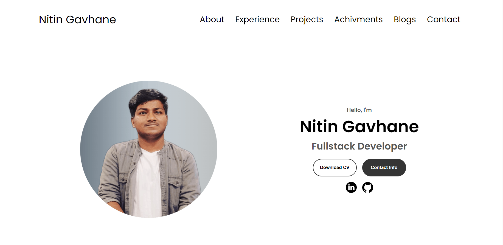

Certainly! Below is a basic template for your README file for a portfolio project created using HTML, CSS, and JavaScript. Feel free to customize it based on your specific project details.

---

# Portfolio Project

Welcome to my portfolio project! This is a simple website created using HTML, CSS, and JavaScript to showcase my skills and projects.



## Project Structure

```
.
|-- assets/
|-- index.html
|-- mediaqueries.css
|-- script.js
|-- style.css
```

- `assets/`: Folder containing project assets such as images, icons, etc.
- `index.html`: The main HTML file for the portfolio.
- `mediaqueries.css`: CSS file for handling media queries and responsive design.
- `script.js`: JavaScript file for any interactive features on the website.
- `style.css`: Main CSS file for styling the portfolio.

## Features

- **Responsive Design**: The portfolio is designed to be responsive and accessible on various devices.
- **Project Showcase**: Display projects with details and links.
- **Skills Section**: Highlight key skills and technologies.
- **Contact Information**: Provide ways to contact the portfolio owner.

## Setup and Configuration

1. **Clone the Repository:**
   ```bash
   https://github.com/NitinGavhane/html-css-js-portfolio-project
   ```

2. **Open in VSCode:**
   Open the project in Visual Studio Code using the following command:
   ```bash
   cd html-css-js-portfolio-project
   ```

3. **Make Edits:**
   Customize the `index.html`, `mediaqueries.css`, `script.js`, and `style.css` files to add your information, projects, and styling.

4. **Preview Locally:**
   Open `index.html` in your web browser to preview your portfolio locally.

5. **Commit and Push Changes:**
   Use GitHub Desktop or the command line to commit your changes and push them to your GitHub repository.

6. **GitHub Pages (Optional):**
   If you want to host your portfolio on GitHub Pages, go to the repository settings, scroll down to the "GitHub Pages" section, and choose the branch to use for hosting (usually `main` or `master`).

   Access your portfolio at: `https://main--resonant-entremet-98f386.netlify.app/`

Feel free to add more sections or details based on your specific project and preferences. Good luck with your portfolio project! 🚀
